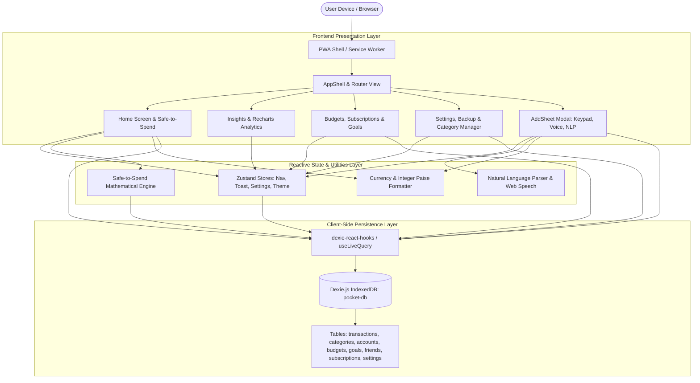

# Project Design & Requirements Report (PDR)
## PaisaPal — Personal & Student Money Tracker

---

### Document Control & Metadata
- **Project Name:** PaisaPal (Money Tracker)
- **Document Type:** Project Design Report (PDR) / Product Requirements Document (PRD)
- **Version:** 1.0.0
- **Author:** Sumit Chame
- **Repository:** `sumit-chame/PaisaPal-Money-Tracker`
- **Live Deployment:** [https://paisa-pal-money-tracker.vercel.app/](https://paisa-pal-money-tracker.vercel.app/)
- **Document Status:** Approved & Production-Ready
- **Target Audience:** Software Engineers, Product Managers, UI/UX Designers, Academic Evaluators

---

## 1. Executive Summary

**PaisaPal** is a lightweight, privacy-centric, offline-first Progressive Web Application (PWA) engineered specifically for students, young professionals, and budget-conscious individuals. Built using **React 19**, **TypeScript 6**, **Vite 8**, **Tailwind CSS v4**, and **Dexie.js (IndexedDB)**, PaisaPal eliminates the major pain points of modern expense trackers: cloud lock-in, mandatory sign-ups, ad clutter, and tedious multi-step manual entry.

The application’s hallmark feature is the **Sub-5-Second Transaction Logging Flow**, augmented with a custom tactile keypad, natural language processing (NLP), voice recognition, and an automated **"Safe-to-Spend"** mathematical engine that prevents end-of-month budget exhaustion.

---

## 2. Problem Statement & Value Proposition

### 2.1 The Problem
1. **High Logging Friction:** Traditional finance apps require 5 to 8 clicks per expense entry (opening app, clicking add, typing amount, opening dropdown, picking category, picking wallet, confirming). As a result, users abandon logging within 14 days.
2. **Cloud Dependency & Privacy Intrusion:** Modern money trackers demand bank SMS permissions, OAuth accounts, and cloud storage, raising severe privacy concerns regarding personal expenditure data.
3. **Passive vs. Active Guidance:** Traditional apps inform users *after* they have overspent (e.g., month-end graphs), rather than providing actionable daily spending boundaries *before* they spend.
4. **Student Use Cases Ignored:** Irregular student cash flows (pocket money, shared mess fees, hostel rent, chai & snacks, split auto rides) are poorly served by corporate accounting software.

### 2.2 The Solution (PaisaPal Value Proposition)
- **Sub-5-Second Logging:** Rapid segmented entry, quick category chips, tactile custom keypad, and one-tap voice input.
- **Dynamic "Safe-to-Spend" Metric:** Real-time computation of today's permissible spending ceiling based on active cycle budget, current spend, and remaining days.
- **100% Local-First & Sovereign:** Zero remote database, zero analytics beacons, zero user accounts. Data resides strictly inside client browser IndexedDB with JSON/CSV import/export.
- **Tailored Student Categories:** Pre-seeded categories including Mess, Chai & Snacks, Mobile Recharge, Books & Stationery, and Friends Split.
- **Structured Engineering Design:** Built with CodeNova design system tokens — high-contrast dark/light modes, solid surfaces, and zero visual gimmicks.

---

## 3. User Personas & Target Audience

| Persona | Description | Primary Needs | Key PaisaPal Feature |
|---|---|---|---|
| **Aarav (Hostel Student)** | 2nd-year engineering student living in a hostel with fixed monthly pocket money. | Needs to avoid running out of money before month end; splits food/cabs with roommates. | Safe-to-Spend banner, Quick Chai/Mess chips, Split with Friends modal. |
| **Priya (Intern / Freelancer)** | Recent graduate with stipend income and freelance gigs. | Tracks irregular income inflows, subscriptions (Spotify, Coursera, Netflix), and multi-account balances (UPI vs Cash). | Multi-account tracking, Subscriptions manager, Income categorization. |
| **Vikram (Privacy Enthusiast)** | Professional wanting strict financial tracking without linking bank credentials or exposing financial trails. | Total data ownership, zero cloud sync, offline availability on mobile. | Offline PWA, IndexedDB storage, JSON database export/import. |

---

## 4. System Architecture & Tech Stack

### 4.1 Architecture Diagram



### 4.2 Technology Stack Specifications

| Layer | Technology | Version | Purpose & Rationale |
|---|---|---|---|
| **Core Framework** | React | `^19.2.8` | Declarative UI, latest concurrent rendering, serverless client architecture. |
| **Language** | TypeScript | `~6.0.2` | Strict end-to-end type safety, domain models, and zero runtime type errors. |
| **Build & Dev Server** | Vite | `^8.3.0` | Sub-second HMR, optimized tree-shaking, fast ESM builds. |
| **Styling** | Tailwind CSS v4 & Vanilla CSS | `^4.3.3` | Custom design token system, responsive layout, ultra-light stylesheet. |
| **Local Database** | Dexie.js & Dexie React Hooks | `^4.4.6` | Browser IndexedDB wrapper with reactive queries (`useLiveQuery`). |
| **State Management** | Zustand | `^5.0.15` | Minimal boilerplate, instantaneous reactivity for UI modals and themes. |
| **Transitions & Gestures** | Framer Motion | `^14.0.0` | Mobile bottom sheet sliding gestures, micro-animations, spring effects. |
| **Data Visualization** | Recharts | `^3.10.1` | Mobile-responsive SVG Donut charts and Daily Spending bar charts. |
| **Iconography** | Lucide React | `^1.52.0` | Crisp vector icons with standardized 1.75px stroke widths. |
| **Date & Time Engine** | date-fns | `^4.4.0` | Cycle mathematics, relative intervals, calendar range operations. |
| **PWA & Offline** | vite-plugin-pwa / Workbox | `^2.0.0` | App manifest, offline asset caching, service worker lifecycle. |
| **Code Quality** | Oxlint & TypeScript Compiler | `^1.81.0` | Ultra-fast Rust-based linting and strict type checking. |

---

## 5. Database Schema & Data Models

All monetary values in PaisaPal are stored as **integer paise** (`amount_in_inr × 100`). This completely eliminates JavaScript IEEE 754 floating-point rounding anomalies (e.g., `0.1 + 0.2 !== 0.3`).

### 5.1 Tables & Entity Definitions

#### 1. `transactions`
```typescript
export interface Transaction {
  id: string              // UUID v4 (Primary Key)
  type: 'expense' | 'income' | 'transfer'
  amount: number          // Integer paise (e.g., ₹120.50 -> 12050)
  categoryId?: string     // Foreign Key -> categories.id
  accountId: string       // Foreign Key -> accounts.id
  toAccountId?: string    // For transfers: destination account
  note?: string           // User description / note
  date: number            // Epoch timestamp in milliseconds
  tags?: string[]         // Searchable tags
  receiptBlobId?: string  // Foreign Key -> receiptBlobs.id
  split?: {
    friendId: string      // Foreign Key -> friends.id
    share: number         // Paise share
    settled: boolean      // Settlement status
  }[]
  recurringId?: string    // Associated recurring rule ID
  createdAt: number       // Creation timestamp
  updatedAt: number       // Last modified timestamp
}
```

#### 2. `categories`
```typescript
export interface Category {
  id: string              // UUID v4 (Primary Key)
  type: 'expense' | 'income'
  name: string            // Display name (e.g., "Food", "Chai & Snacks")
  icon: string            // Lucide icon name (e.g., "Coffee", "UtensilsCrossed")
  color: string           // Hex code from Brand Swatches (e.g., "#00BFA6")
  order: number           // Display sort order
  hidden?: boolean        // Visibility toggle
  keywords?: string[]     // NLP matching dictionary
  isDefault?: boolean     // System-seeded vs user-created
}
```

#### 3. `accounts`
```typescript
export interface Account {
  id: string              // UUID v4 (Primary Key)
  name: string            // e.g., "Cash", "UPI / Bank", "Credit Card"
  kind: 'cash' | 'bank' | 'upi' | 'card' | 'other'
  openingBalance: number  // Initial balance in paise
  createdAt: number
}
```

#### 4. `budgets`
```typescript
export interface Budget {
  id: string              // UUID v4 (Primary Key)
  name: string            // e.g., "Monthly Total", "Food Envelope"
  categoryId?: string     // Optional: category-specific envelope or total
  amount: number          // Total budget limit in paise per cycle
  cycleStartDay: number   // Day of month (1 to 28)
  rollover?: boolean      // Carry forward unused balance
  color?: string
}
```

#### 5. `goals`
```typescript
export interface Goal {
  id: string              // UUID v4 (Primary Key)
  name: string            // e.g., "New Laptop", "Semester Trip"
  target: number          // Target amount in paise
  saved: number           // Current saved amount in paise
  deadline?: number       // Target completion epoch ms
  icon: string            // Lucide icon identifier
  color: string           // Hex color
  createdAt: number
}
```

#### 6. `subscriptions`
```typescript
export interface Subscription {
  id: string              // UUID v4 (Primary Key)
  name: string            // e.g., "Netflix", "Spotify Premium"
  amount: number          // Subscription recurring cost in paise
  interval: 'weekly' | 'monthly' | 'yearly'
  nextDue: number         // Epoch timestamp of next scheduled payment
  categoryId?: string
  color?: string
  icon?: string
}
```

#### 7. `friends`
```typescript
export interface Friend {
  id: string              // UUID v4 (Primary Key)
  name: string            // Friend name
  createdAt: number
}
```

#### 8. `settings`
```typescript
export interface Settings {
  id: 1                   // Singleton row (Primary Key = 1)
  currency: string        // Default: 'INR'
  locale: string          // Default: 'en-IN'
  theme: 'dark' | 'light' | 'system'
  cycleStartDay: number   // Default: 1
  appLock?: boolean
  dailyReminderTime?: string // Format: "HH:MM"
  streakEnabled: boolean
  schemaVersion: number
}
```

---

## 6. Detailed Feature Specifications & Algorithms

### 6.1 Sub-5-Second Transaction Logging Flow
1. **Trigger:** Floating action button (`+`) or single keypress shortcut (`N`).
2. **Segment Selection:** Expense, Income, or Transfer (defaults to Expense).
3. **Keypad Entry:** Custom 12-key numeric keypad (`1-9`, `0`, `.`, `⌫`) with 8ms haptic vibration (`navigator.vibrate(8)`).
4. **Quick Category Grid:** Immediate single-tap category chips with Lucide icons.
5. **Persistence & Feedback:** Saves immediately to IndexedDB; triggers a floating Toast with a **5-second Undo action**.

### 6.2 The Safe-to-Spend Mathematical Engine
The engine prevents mid-month overspending by recalculating allowances daily:

$$\text{Cycle Start Date} = \begin{cases} \text{Date}(\text{Year}, \text{Month}, \text{CycleDay}), & \text{if } \text{CycleStart} \le \text{Today} \\ \text{Date}(\text{Year}, \text{Month} - 1, \text{CycleDay}), & \text{otherwise} \end{cases}$$

$$\text{Days Remaining} = \max\left(1, \, \text{differenceInDays}(\text{CycleEnd}, \text{Today})\right)$$

$$\text{Remaining Cycle Budget} = \text{Total Cycle Budget} - \text{Total Cycle Expenses}$$

$$\text{Daily Allowance} = \frac{\text{Remaining Cycle Budget}}{\text{Days Remaining}}$$

$$\text{Safe-to-Spend Today} = \text{Daily Allowance} - (\text{Today's Expenses} - \text{Today's Income})$$

#### Status Thresholds:
- **On Track (`--income` / `#00BFA6`):** Cycle spent $< 80\%$ of budget.
- **Tight (`#D97706`):** Cycle spent between $80\%$ and $100\%$ of budget.
- **Over Budget (`--expense` / `#FF7A59`):** Cycle spent $> 100\%$ of budget.

### 6.3 Natural Language & Voice Input Parser
The parser processes text strings (typed or captured via `webkitSpeechRecognition`):
- **Income Keyword Detection:** Checks for keywords: `salary`, `stipend`, `income`, `earned`, `received`, `got`, `pocket money`, `allowance`, `scholarship`, `freelance`.
- **Date Extraction:** Detects relative tokens (`"today"`, `"yesterday"`, `"day before yesterday"`).
- **Amount Extraction:** Regex handles shorthand notations: `₹`, `rs`, `inr`, decimal values, and `"k"` multiplier (e.g., `2.5k` $\rightarrow$ `₹2,500.00`).
- **Category Token Matching:** Matches input tokens against categories and synonym keywords (e.g., `"auto"` $\rightarrow$ Transport, `"chai"` $\rightarrow$ Chai & Snacks, `"maggi"` $\rightarrow$ Food).

### 6.4 Budget Envelopes, Subscriptions & Goals
- **Category Envelopes:** Real-time visual progress meters showing spend versus category limit.
- **Subscriptions Tracker:** Computes countdown days until next renewal; provides one-tap "Mark as Paid" action which logs the expense and advances the `nextDue` date by the defined interval.
- **Savings Goals:** Visual progress vault displaying target versus accrued savings.

### 6.5 Split Expenses with Friends
- Multi-friend selection on any transaction.
- Calculates individual shares in real-time.
- Records unsettled balances per friend in the Me screen with settlement actions.

### 6.6 Visual Analytics & Insights
- Period selection: **This Week**, **This Month**, **Last Month**.
- Interactive Recharts Donut Chart of top expense categories with total percentage distribution.
- Daily expenditure bar charts highlighting spending spikes.

---

## 7. UI / UX Design System (CodeNova Restyle)

The design adopts CodeNova Tech Solutions' engineering aesthetic: solid, crisp, high-contrast surfaces without fuzzy glow or glassmorphic blur.

### 7.1 Core Tokens

| Variable | Light Mode | Dark Mode | Usage |
|---|---|---|---|
| `--bg` | `#F4F6F8` | `#0A0F1D` | Application background |
| `--surface` | `#FFFFFF` | `#131A2A` | Cards, sheets, navbars |
| `--surface-2` | `#ECEEF2` | `#1D283E` | Inputs, raised items |
| `--border` | `#E2E8F0` | `#25334E` | 1px border lines |
| `--text` | `#222222` | `#F8FAFC` | Main headings & text |
| `--text-muted` | `#555555` | `#94A3B8` | Timestamps, labels |
| `--primary` | `#1F3B6F` | `#00BFA6` | Primary action button |
| `--income` | `#00BFA6` | `#00BFA6` | Inflows, on-track status |
| `--expense` | `#FF7A59` | `#FF7A59` | Outflows, over-budget |
| `--transfer` | `#1F3B6F` | `#60A5FA` | Transfer amounts |

### 7.2 Curated Brand Swatch Palette (12 Colors)
1. Tech Navy: `#1F3B6F`
2. Brand Teal: `#00BFA6`
3. Coral Orange: `#FF7A59`
4. Cobalt Blue: `#2563EB`
5. Dark Teal: `#0D9488`
6. Forest Green: `#16A34A`
7. Amber Gold: `#D97706`
8. Crimson Red: `#D4183D`
9. Indigo: `#4F46E5`
10. Steel Blue: `#7A9CBF`
11. Slate Gray: `#475569`
12. Deep Slate: `#334155`

---

## 8. Web APIs & Hardware Integrations

1. **Web Speech API (`webkitSpeechRecognition`):** Enables native, continuous voice transcription directly into the NLP parser without external cloud speech APIs.
2. **Navigator Vibration API (`navigator.vibrate`):** Fires short 8ms haptic pulses during keypad entry for tactile feedback.
3. **Browser IndexedDB & Blob API:** Stored locally on-device. Images/receipts stored as Blobs without remote hosting.
4. **Service Worker & Manifest:** PWA caching enables 100% offline launch, installability on iOS and Android, and sub-100ms load times.

---

## 9. Security, Privacy & Data Sovereignty

- **Zero Remote Storage:** The application operates without backend databases, API gateways, or tracking pixels.
- **Zero Third-Party Telemetry:** No Google Analytics, no tracking scripts, no advertisements.
- **Full Data Backup & Restore:**
  - **JSON Export/Import:** Dumps entire IndexedDB database into an indented JSON file; restores database with a single click.
  - **CSV Export:** Generates standard spreadsheet CSV files (Date, Type, Category, Amount, Account, Note).
- **Hard Reset Option:** Provides an immediate database wipe that clears all tables and restores initial seed configuration.

---

## 10. Repository Structure & File Mapping

```
PaisaPal/
├── .github/                     # GitHub workflows and issue templates
├── public/                      # Static assets, icons, PWA manifest & service worker
│   ├── favicon.ico
│   ├── icon-192.png
│   └── icon-512.png
├── src/
│   ├── assets/                  # Logos and static media
│   ├── components/              # UI components and modals
│   │   ├── ui/                  # Reusable low-level widgets (ToastContainer, Dialogs)
│   │   ├── AddAccountModal.tsx  # Add custom bank/wallet modal
│   │   ├── AddCategorySheet.tsx # Create custom category with color/icon picker
│   │   ├── AddFriendModal.tsx   # Add friend for bill splitting
│   │   ├── AddSheet.tsx         # Primary logging sheet (Keypad, NLP, Voice, Split)
│   │   ├── AddSubscriptionModal.tsx # New subscription setup
│   │   ├── AppShell.tsx         # Bottom tab navigation, lazy-loaded screen manager
│   │   ├── CategoryIcon.tsx     # Dynamic Lucide icon renderer
│   │   └── CategoryManagerSheet.tsx # Reorder, hide, edit categories
│   ├── lib/                     # Core business logic and database layer
│   │   ├── currency.ts          # Integer paise formatters, currency symbols
│   │   ├── db.ts                # Dexie IndexedDB schemas & table declarations
│   │   ├── init.ts              # First-run database initialization & demo data generator
│   │   ├── parser.ts            # Natural language & voice entry parsing engine
│   │   ├── safeToSpend.ts       # Safe-to-Spend mathematical algorithm
│   │   └── seeds.ts             # Default categories, accounts & swatch constants
│   ├── screens/                 # Main top-level application screens
│   │   ├── HomeScreen.tsx       # Safe-to-Spend gauge, recent feeds, inline actions
│   │   ├── BudgetsScreen.tsx    # Category envelopes, subscriptions, savings goals
│   │   ├── InsightsScreen.tsx   # Recharts charts, spending breakdowns, trends
│   │   └── MeScreen.tsx         # Profile, account settings, backup/restore, themes
│   ├── store/                   # Reactive state management
│   │   └── index.ts             # Zustand stores (Nav, Toast, Settings, Theme)
│   ├── styles/                  # Global style tokens and theme definitions
│   │   └── tokens.css           # CodeNova design tokens (Dark/Light variables)
│   ├── App.css                  # Component-level layout styles
│   ├── App.tsx                  # Root React application wrapper
│   ├── index.css                # Base Tailwind v4 configuration and resets
│   └── main.tsx                 # React DOM mount point & initial seed trigger
├── DESIGN.md                    # CodeNova design system specification
├── PDR.md                       # Complete Project Design & Requirements Report (this document)
├── README.md                    # Project README and quickstart guide
├── package.json                 # Project dependencies and script commands
├── tsconfig.json                # TypeScript compiler configuration
└── vite.config.ts               # Vite configuration with PWA plugin
```

---

## 11. Build, Verification & Execution Instructions

### 11.1 Prerequisites
- **Node.js:** v18.0.0 or higher
- **npm:** v9.0.0 or higher

### 11.2 Installation
```bash
git clone https://github.com/sumit-chame/PaisaPal-Money-Tracker.git
cd PaisaPal-Money-Tracker
npm install
```

### 11.3 Local Development
```bash
npm run dev
```
Serves the application locally at `http://localhost:5173`.

### 11.4 Quality Assurance & Linting
```bash
npm run lint
```
Executes Oxlint across all TypeScript and TSX files.

### 11.5 Production Build
```bash
npm run build
```
Executes TypeScript compilation check (`tsc -b`) followed by Vite bundle generation into `dist/`.

---

## 12. Future Roadmap & Enhancement Horizons

1. **P2P Multi-Device Sync:** End-to-end encrypted synchronization across devices using CRDTs (Yjs) and WebRTC without centralized servers.
2. **On-Device Receipt OCR:** Client-side optical character recognition using Tesseract.js / WebAssembly to automatically parse totals from camera receipt photos.
3. **Budget Auto-Adjustment:** Machine learning recommendation models running in-browser to propose realistic category allowances based on past 90-day spending trends.
4. **Export Formats:** Additional export formats including PDF financial statements and Excel workbook sheets.
